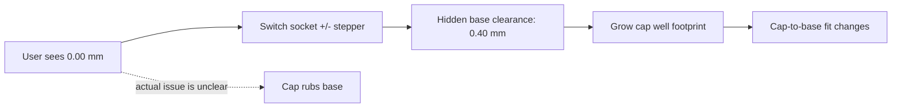
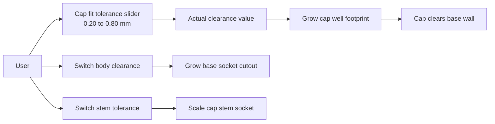

# Cap fit control during the upstream merge

## Current canonical flow

The canonical control still changes the cap-to-base clearance, but the visible value is an offset from 0.40 mm and the switch-oriented label obscures what is being adjusted.

## Target flow

The merge keeps the newer canonical features while presenting each physical fit as a separate control:

- Cap fit tolerance adjusts the cap-to-base gap and displays the actual millimetre value.
- Switch body clearance adjusts the MX housing cutout in the base.
- Switch stem tolerance adjusts how the cap stem grips the MX switch.
