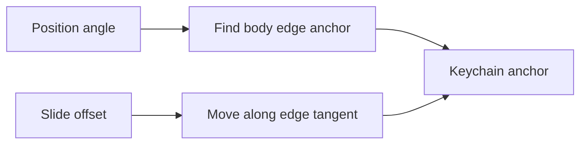
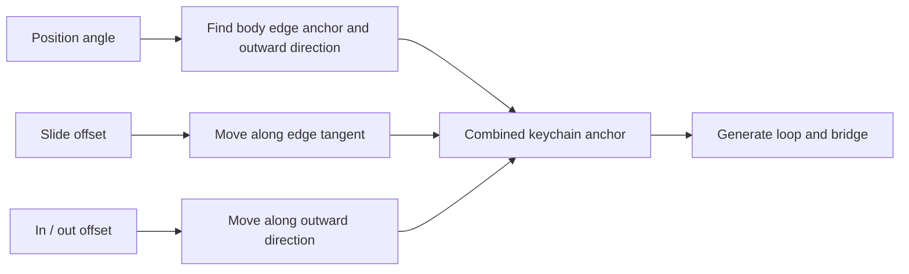

# Keychain two-axis positioning

## Current flow

At the top of the design, the edge tangent runs left to right, so the current offset cannot move the keychain toward or away from the body.

## Target flow

The final anchor is computed as:

`edge anchor + tangent * slide offset + outward direction * in/out offset`

- Slide offset keeps the existing left/right fine-tuning.
- In / out offset adds movement toward or away from the clicker body.
- Both offsets remain relative to the selected position angle.
